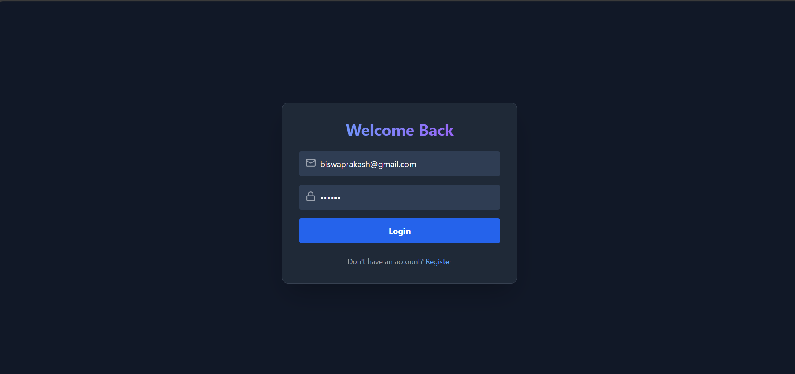
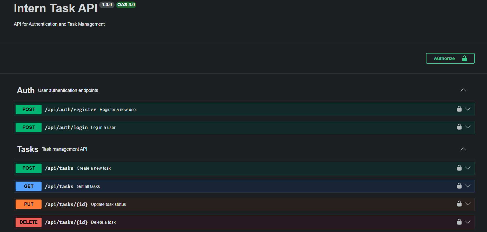

# 🚀 Backend Developer Intern Task

A robust, scalable Full-Stack application built with **Node.js, TypeScript, Express, MongoDB, Redis, and React**.

---

## 📸 Project Preview

### 🔐 Authentication Page


### 📊 Dashboard View


---

## 🌟 Key Features

* 🔐 **Secure Authentication:** JWT-based stateless auth with bcrypt password hashing.
* 👤 **Role-Based Access Control (RBAC):** Distinct permissions for `User` and `Admin` roles.
* ⚡ **Redis Cache-Aside Pattern:** Sub-millisecond reads for Task APIs.
* 📝 **Task Management:** Full CRUD operations with instant cache invalidation.
* 📄 **Swagger Documentation:** Interactive API testing.
* 🛡️ **Type Safety:** Built with TypeScript.
* 📊 **Logging:** Request logging using morgan.
* 🎨 **Responsive UI:** Built with React + Tailwind CSS.

---

## 🛠️ Tech Stack

### Backend
- Node.js
- Express.js
- TypeScript
- MongoDB (Mongoose)
- Redis (ioredis)

### Frontend
- React
- Vite
- Tailwind CSS
- Lucide Icons

---

## 🏗️ System Architecture


---

## ⚡ Redis Caching Strategy


- Implements **Cache-Aside Pattern**
- TTL: 1 Hour
- Automatic cache invalidation on:
  - Create
  - Update
  - Delete

---

## 🚀 Setup & Installation

### 1️⃣ Prerequisites

- Node.js (v18+)
- MongoDB
- Redis

---

### 2️⃣ Clone Repository

```bash
git clone <your-repo-link>
cd <your-repo-name>
```

---

### 3️⃣ Backend Setup

```bash
cd backend
npm install
cp .env.example .env
npm run dev
```

---

### 4️⃣ Frontend Setup

```bash
cd frontend
npm install
npm run dev
```

---

## 🔑 Environment Variables

Create `.env` in backend folder:

```env
PORT=5000
MONGO_URI=mongodb://localhost:27017/intern-task
JWT_SECRET=your_super_secret_key
REDIS_URL=redis://localhost:6379
```

---

## 📖 API Documentation

### Swagger UI



👉 Visit: http://localhost:5000/api-docs

---

## 📂 Folder Structure

```
├── backend/
│   ├── src/
│   │   ├── config/
│   │   ├── controllers/
│   │   ├── middlewares/
│   │   ├── models/
│   │   ├── routes/
│   │   └── index.ts
│   └── dist/
│
└── frontend/
    ├── src/
    │   ├── components/
    │   ├── pages/
    │   └── App.tsx
```

---

## 📈 Scalability Highlights

- Stateless JWT Authentication
- Horizontal Scaling Ready
- Redis Memory Caching
- Indexed MongoDB Queries
- Modular Service Architecture

---

## 👨‍💻 Author

**Biswa Prakash Dalai**

---

## ⭐ If you like this project, give it a star!
